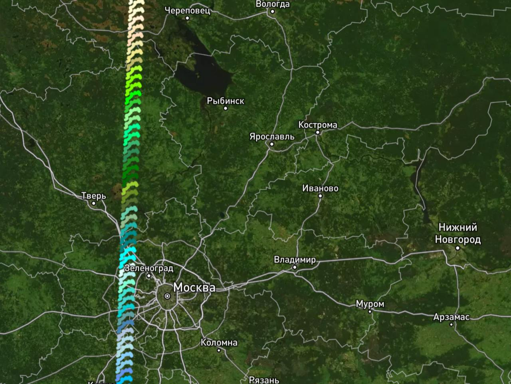

# 🗺 mapbox-adventure
Mapbox Adventure lets you design your own maps


https://andrewalevin.github.io/mapbox-adventure/

## 🗺 Cozyspots

- `index.html`
- `data.yaml`


#### index.html

```html
<!DOCTYPE html>
<html lang="en">

<head>
    <meta charset="utf-8">
    <meta name="viewport" content="initial-scale=1,maximum-scale=1,user-scalable=no">
    <!-- 💚 CHANGE 📝 -->
    <meta name="description" content="🗺 Explore SandBox interactive map with Mapbox and custom features.">
    <!-- 💚 CHANGE 📝 -->
    <meta property="og:title" content="🗺 SandBox" />

    <!-- 💚 CHANGE 📝 -->
    <meta property="og:description" content="🗺 SandBox Description" />
    <meta property="og:type" content="website" />
    <!-- 💚 CHANGE 📝 -->
    <meta property="og:url" content="/maps2/sandbox/" />
    <!-- 💚 CHANGE 📝 -->
    <meta property="og:image" content="/maps2/sandbox/preview.png" />

    <!-- 💚 CHANGE 📝 -->
    <title>🗺 SandBox</title>

    <!-- Mapbox CSS -->
    <link href="https://api.mapbox.com/mapbox-gl-js/v3.8.0/mapbox-gl.css" rel="stylesheet">

    <!-- Mapbox JS -->
    <script src="https://api.mapbox.com/mapbox-gl-js/v3.8.0/mapbox-gl.js"></script>

    <!-- Mapbox-Adventure.CozySpots CSS -->
    <link href="https://andrewalevin.github.io/mapbox-adventure/src/cozyspots-v2.0.css" rel="stylesheet">

    <!-- Inline styles if necessary -->
    <style>

    </style>
</head>
<body>
<div id="map"></div>

<!-- JS Libraries -->
<script src="https://andrewalevin.github.io/mapbox-adventure/assets/js-yaml.min.js"></script>
<script src="https://unpkg.com/@turf/turf@6/turf.min.js"></script>

<!-- 💚 CHANGE 📝 -->
<!-- Configurations -->
<script>
    let config = {
        mapboxToken: '****TOKEN****',
    }
</script>

<!-- Mapbox-Adventure.CozySpots JS -->
<script src="https://andrewalevin.github.io/mapbox-adventure/src/cozyspots-v2.0.js"></script>

</body>
</html>
```


#### data.yaml

```yaml
%YAML 1.2
---

# Full 
- coords: 55.728324, 37.555595
  title: Дорогу утятам!
  about: Дорогу утятам! D
  img: utki.png

- coords: 55.742752, 37.612733
  title: ГЭС-2
  about: ГЭС-2 - D
  img: ges2.png
  link: https://andrewalevin.github.io/mapbox-adventure/
  kind: culture museum

- coords: 55.743758, 37.597320
  title: Музей А. С. Пушкина
  about: Музей А. С. Пушкина
  img: pushkin.png
  link: https://yandex.ru/maps/-/CDxtqN5l
  kind: museum

- coords: 55.746589, 37.605129
  title: Галерея искусства стран Европы и Америки XIX – XX веков
  about: Галерея искусства стран Европы и Америки XIX – XX веков
  img: gmii-galery.png
  link: https://yandex.ru/maps/-/CDxtqROY
  kind: culture museum

- coords: 55.747224, 37.605240
  title: ГМИИ

# Overriding all avaliable rows
- coords: 55.738737, 37.596090
  title: |
    <h1>Музей И.С. Тургенева</h1>
  about: |
    <p><span style="color:#00acc1;">Описание музея Тургенева</span></p>
    <p><span style="color:#ab47bc;"><strong><u>Второе описание музея Тургенева</u></strong></span></p>
    <p><span style="color:#7cb342;"><i>Третее описание музея Тургенева</i></span></p>
  img: turgenev.png
  link: |
    <a href="https://yandex.ru/maps/-/CDxtqZ2U" style="color: green;">Музей Тургенева на Яндекс Картах</a>

- title: Перезвон кафе
  about: Перезвон кафе
  img: perezvon.png

- title: Cобор Петра и Павла
  about: Cобор Петра и Павла
  img: petra-pavla-cathidral.png

- coords: 55.735631, 37.624037
  title: Нитка чайная
  about: Нитка чайная
  img: nitka.png

- coords: 55.724326, 37.592946
  title: Андреевский мост
```


#### config all settings

```js
let config = {
        mapboxToken: '****TOKEN****',
    }
```


#### Color Palette



https://andrewalevin.github.io/mapbox-adventure/colorpalette/